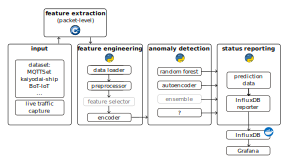
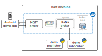

# Scalable IoT Usage Research Utility (SIURU)

A framework for IoT anomaly detection, created at the National Institute of Informatics during the research internship program.

## System architecture

Below is a diagram of the core components in the IoT-AD pipeline, with arrows marking the flow of data between components:



Elements in gray are not yet implemented. For details on the components, see the _Repository Structure_ section below.

## Reporting (optional)

These components are used in the demo configurations to store model predictions. It is possible to run the demos without InfluxDB + Grafana reporting by removing the ``InfluxDBReporter`` entry from the output section of configuration files.

### InfluxDB

Install [InfluxDB](https://docs.influxdata.com/influxdb/v2.6/install/) for example as a Docker container and follow the setup guide to create an organization and bucket.

Also create a directory where InfluxDB should store the data. In the commands below, it is referred to as `</project/root>/influxdb`.

Start the image with:
```
docker run -p 8086:8086 \
--volume </project/root>/influxdb:/var/lib/influxdb2 \
influxdb:2.6.1 --reporting-disabled
```

From the interface that starts under http://localhost:8086 by default, generate a token (Load Data > API Tokens) with read-write permissions to use in Grafana and when running `IoT-AD.py` with reporting enabled.

If you later wish to clear the sample data stored in InfluxDB, use the following recipe, replacing the token placeholder with your generated one:

```bash
# Find the name of the container.
docker ps
# Open interactive shell.
docker exec -it frosty_dijkstra /bin/bash

# Inside the shell, run the deletion command.
influx delete --bucket default --org default \
--start 2009-01-02T23:00:00Z --stop 2024-01-02T23:00:00Z \
--token <token>
exit
```

### Grafana

Install [Grafana](https://grafana.com/docs/grafana/latest/setup-grafana/installation/debian/) for example by following the guide for Ubuntu and Debian. Start the service:

```bash
sudo service grafana-server start
```

and follow the guide to set up an [InfluxDB data source](https://grafana.com/docs/grafana/latest/datasources/influxdb/). If all goes well, Grafana should be able to connect to the InfluxDB instance you are running.

## Quickstart with Docker

### Setting up the repository

After cloning the repository, make sure to initialize the submodules (PcapPlusPlus and MQTTset-reduced):

```bash
git submodule update --init --recursive
```

### Build the container

This automatic build is a quick alternative to manually setting up a Python environment as described below. First, make sure Docker is installed and the daemon is running.

Then you can build the container locally. In this example, the container will be tagged as ``siuru:latest``:

```bash
cd code
docker build . -t siuru:latest
```

### Start the container

Replace the project root placeholders with the absolute path to your local SIURU repository. The command maps your local configuration, data, and model paths into the container, allowing the trained model to persist over multiple runs. The ``--network-host`` flag is needed to store prediction reports in InfluxDB (enabled in the sample configuration files).

```bash
docker run -it \
--network=host \
-v </project/root>/configurations:/configurations \
-v </project/root>/data:/data \
-v </project/root>/models:/models \
siuru:latest \
/bin/bash
```

### Train a random forest model

In the interactive Docker session, run:

```bash
python3 code/IoT-AD.py \
-c /configurations/tutorial/
-multi-rf-influxdb-train.json.jinja2
```

The model will be stored under ``</project/root>/models/window-multi-rf-influxdb``.

### Test the model

In an interactive session, run the following command, replacing the placeholder with a token generated in InfluxDB as described previously:

```bash
python3 code/IoT-AD.py \
-c /configurations/tutorial/window-multi-rf-influxdb-test.json.jinja2 \
--influx-token <token>
```

You should see prediction data being stored in InfluxDB tagged as: ``_measurement="window-multi-rf"``

## Setup without Docker

The pipeline is written in Python and C++, therefore Python requirements must be installed and the C++ feature extractor component built before running the pipeline.

The commands below are meant to be run on Ubuntu 20.04.

### Setting up the repository

After cloning the repository, make sure to initialize the submodules (PcapPlusPlus and MQTTset-reduced):

```bash
git submodule update --init --recursive
```

### Python environment

It is recommended to set up a Python virtual environment, e.g. pyenv. The Python libraries needed by this project can then be installed by running from project root:

```bash
pip install -r code/requirements.txt
```

### Feature extractor

Since it is in C++, the code needs to be compiled using CMake, which can be installed via Snap or package manager. 

In addition, the following dependencies are needed:
```bash
sudo apt install libpcap-dev
```

Build and install PcapPlusPlus, then build the feature extractor as follows:

```bash
cd code/cpp-extract-features/PcapPlusPlus
cmake -S . -B cmake-build
cmake --build cmake-build --config Release
sudo cmake --install cmake-build

cd ..
mkdir cmake-build && cd cmake-build
cmake ../..
cmake --build . --config Release
sudo setcap cap_net_raw+ep $(pwd)/pcap-feature-extraction
```

The last command is needed to give the executable permissions to listen on the network interfaces. The path to the C++ executable is a command line argument to the main anomaly detection program ``IoT-AD.py``. Whenever the executable is recompiled, the
permissions must also be assigned again.

### Training a model

Refer to the command line hints of ``code/IoT-AD.py`` for information on the available parameters, and the files under `configurations/tutorial` for the sample configuration files this demo will be using.

The example below assumes that we have built the C++ feature extractor using CMake under `<code/cpp-extract-features/cmake-build`.

As a result of successful training, we will have a random forest classifier stored under `</project/root>/models/window-multi-rf-influxdb/window-multi-rf-influxdb.pickle`.

```bash
python code/IoT-AD.py \
-c configurations/tutorial/window-multi-rf-influxdb-train.json.jinja2
```

### Running anomaly detection

Refer to the commandline hint of ``code/IoT-AD.py`` for information on the available parameters.

The sample command below assumes that we have the following:
1. built the C++ feature extractor using CMake under `<code/cpp-extract-features/cmake-build`,
2. trained and stored the model under `</project/root>/models/window-multi-rf-influxdb/window-multi-rf-influxdb.pickle` (see previous section),
3. configured InfluxDB as seen below, including the generated token.

```bash
python code/IoT-AD.py \
-c configurations/tutorial/window-multi-rf-influxdb-test.json.jinja \
--influx-token <token>
```

## Example pipelines

Under `configurations/examples`, you can currently find 12 configurations demonstrating the possible combinations of components implemented in SIURU.

The examples are automatically run as tests in the SIURU GitHub repository, but it is possible to run them locally after you have finished the setup (e.g. built the C++ feature extractor, installed Python dependencies):

```bash
./.ci/run_sample_configurations.bash
```

Extending the test cases is easy: add your training and testing configurations into the same directories and they will be found by the CI script. 

## Working with data

Use the bash script under ``code/split_dataset.bash`` to split a PCAP file into training, validation, and test sets. The script works based on flows, so packets from the same connection end up in the same file after the split.

The script makes use of ``PcapSplitter`` and ``mergecap``, which are both installed in the Docker image mentioned above. If you run the Docker image with a mapping to the data directory, the script should work out-of-the-box (replace </project/root> with your local path to the project):

```bash
docker run -it \
-v </project/root>/code:/code \
-v </project/root>/data:/data \
siuru:latest \
/bin/bash
```

In the container, you can run:
```bash
cd code
./split_dataset.bash --help
./split_dataset.bash head-tail /data/MQTTset/Data/PCAP/slowite.pcap /data/MQTTset/Data/PCAP/slowite-train-60-val-10-test-30 60 10
./split_dataset.bash round-robin /data/MQTTset/Data/PCAP/bruteforce.pcapng /data/MQTTset/Data/PCAP/bruteforce-train-90-val-5-test-5 90 5 5
```

## Repository structure

### code/common

### code/cpp-extract-features

Contains the feature extractor component written in C++, setup instructions above.

### code/dataloaders

Contains a generic data loader interface and some implementations, e.g. to load samples from a pcap file using `cpp-extract-features`.


### code/encoders

Contains a generic feature encoder interface and implementations to encode a single or multiple samples using Numpy / xarray.

### code/Kafka

The Docker container that can listen on network interfaces and capture packet data. As proof-of-concept, the following system was setup:



In the future, the container should offer access to all the IoT-AD functionalities from this project.

### code/models

Contains a generic anomaly detection model interface and some implementations used to test the anomaly detection pipeline.

### code/preprocessors

Contains a generic feature preprocessor interface and several implementations, including a converter from packet- to flow-based samples.

### code/reporting

Reporting module sends prediction data to a logging or visualization endpoint.

In the future, this component would interface with a network controller that takes actions based on the anomaly detection output.

### code/IoT-AD.py

The entry point to the IoT anomaly detection pipeline.

### configurations

Configuration files, which are required input for the IoT anomaly detection program.

The files are Jinja2 templates for JSON files and must define three pipeline elements: data source(s), ML model, and output. [Jinja](https://palletsprojects.com/p/jinja/) is used to support template variables, which the main program will replace with computed values during runtime evaluation.

As a reference for the pipeline used to train a ML model, a copy of the processed configuration file is stored in the same directory as the model after training.

To distinguish models by their creation date, include the `{{ timestamp }}` template variable in the "model_name" field of the configuration file. The model name and directory will then include a timestamp from the beginning of program execution.

### data

See README.md for references to some available datasets. A small sample dataset (MQTTset-reduced) is included as a submodule.

Data is automatically moved here when you run the `code/stop_kafka_pcap.bash` script. Pcap files are stored with timestamps. While timestamps in pcap filenames are in UST, packets inside store the capture timestamp in system time (without time zone information).
